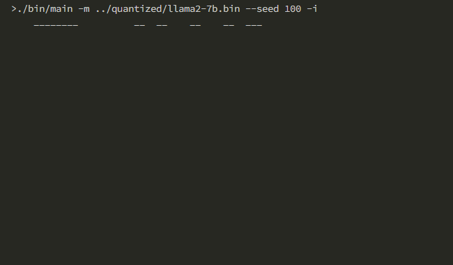

# ChatLLM.cpp

[English](README.md)

[](LICENSE)



在计算机（CPU）上实时聊天，可 [检索增强生成](./docs/rag.md) 。支持从不到 3B 到超过 300B 的一系列模型的推理。基于 [@ggerganov](https://github.com/ggerganov) 的 [ggml](https://github.com/ggerganov/ggml)，纯 C++ 实现。

| [支持的模型](./docs/models.md) | [下载量化模型](https://modelscope.cn/models/judd2024/chatllm_quantized_models) |

## 特点

- [x] 内存高效、加速 CPU 推理：使用 int4/int8 量化、优化的 KV 缓存和并行计算。
- [x] 面向对象编程：关注基于 Transformer 的模型之间的相似性。
- [x] 流式生成：打字机效果。
- [x] 连续聊天：内容长度几乎无限。

    有两种方法可用：_restart_ 和 _Shift_。请参阅 `--extending` 选项。

- [x] 检索增强生成（RAG） 🔥

- [x] LoRA
- [x] Python/JavaScript/C [绑定](./docs/binding.md)，网页演示，以及更多可能性。

## 使用方法

#### 准备工作

将 ChatLLM.cpp 存储库克隆到本地计算机：

```sh
git clone --recursive https://github.com/foldl/chatllm.cpp.git && cd chatllm.cpp
```

如果在克隆存储库时忘记了 `--recursive` 标志，请在 chatllm.cpp 文件夹中运行以下命令：

```sh
git submodule update --init --recursive
```

#### 量化模型

**可以从[这里](https://modelscope.cn/models/judd2024/chatllm_quantized_models)下载一些量化模型。**

为 `convert.py` 安装依赖:

```sh
pip install -r requirements.txt
```

使用 `convert.py` 将模型转换为量化的 GGML 格式。例如，要将某个模型转换为 q8_0（int8 量化）GGML 模型，请运行以下命令：

```sh
# 对于 ChatLLM-6B, ChatLLM2-6B, InternLM, LlaMA, LlaMA-2, Baichuan-2 等模型，使用以下命令转换
python3 convert.py -i path/to/model -t q8_0 -o quantized.bin

# 对于像 CodeLlaMA 等模型，模型的类型需要通过 `-a` 参数指定。
# `docs/models.md` 说明了这些模型需要的 `-a` 参数。
python3 convert.py -i path/to/model -t q8_0 -o quantized.bin -a CodeLlaMA
```

使用 `-l` 参数指定要合并的　LoRA 模型所在目录。例如:

```sh
python3 convert.py -i path/to/model -l path/to/lora/model -o quantized.bin
```

说明：大体上，仅支持 HF 格式；生成的 `.bin` 文件格式不同于当前 `llama.cpp` 项目所使用的 GGUF。

### 编译

你可以使用以下几种方式编译本项目。

- 使用 `make`:

  Windows 使用 `make` 需要的准备工作:

  1. 下载最新版本的 [w64devkit](https://github.com/skeeto/w64devkit/releases)；
  2. 将 `w64devkit` 解压；
  3. 运行 `w64devkit.exe`，然后 `cd` 到 `chatllm.cpp` 所在目录。

  ```sh
  make
  ```

  可执行程序为 `./obj/main`。

- 使用 `CMake` 编译项目:

  ```sh
  cmake -B build
  # 在 Linux 或 WSL 上：
  cmake --build build -j
  # 在 Windows 上使用 MSVC：
  cmake --build build -j --config Release
  ```

  可执行程序为 `./build/obj/main`。

### 运行

现在，您可以通过以下方式与量化模型进行对话：

```sh
./build/bin/main -m chatglm-ggml.bin                            # ChatGLM-6B
# 你好👋！我是人工智能助手 ChatGLM-6B，很高兴见到你，欢迎问我任何问题。
./build/bin/main -m llama2.bin  --seed 100                      # Llama-2-Chat-7B
# Hello! I'm here to help you with any questions or concerns ....
```

要在交互模式下运行模型，请添加 `-i` 标志。例如：

```sh
# 在 Windows 上：
.\build\bin\Release\main -m model.bin -i

# 在 Linux（或 WSL）上：
rlwrap ./build/bin/main -m model.bin -i
```

在交互模式下，您的聊天历史将作为下一轮对话的上下文。

运行 `./build/bin/main -h` 以探索更多选项！

## 致谢

* 本项目起初是对 [ChatGLM.cpp](https://github.com/li-plus/chatglm.cpp) 的重构，没有它，这个项目将无法实现。

* 感谢那些发布了模型源代码和检查点的人。

## 注意

这个项目是我用来学习深度学习和 GGML 的业余项目，目前正在积极开发中。欢迎修复 bug 的 PR，但不接受功能性的 PR。
