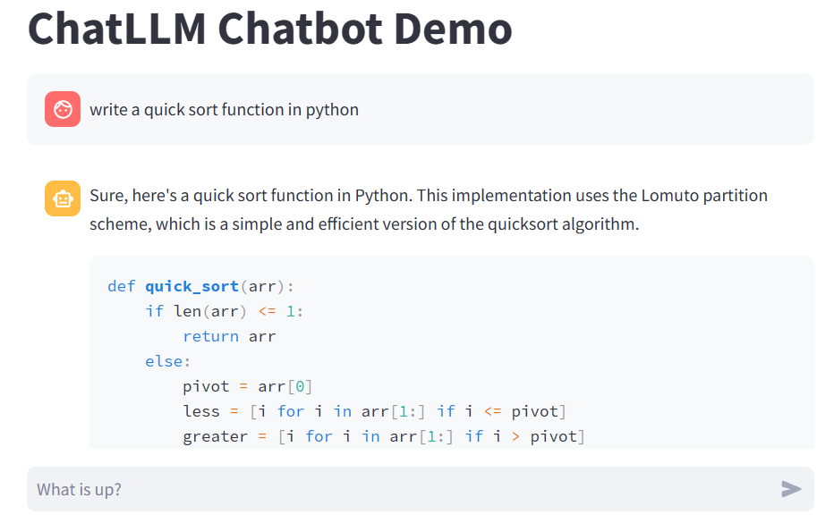
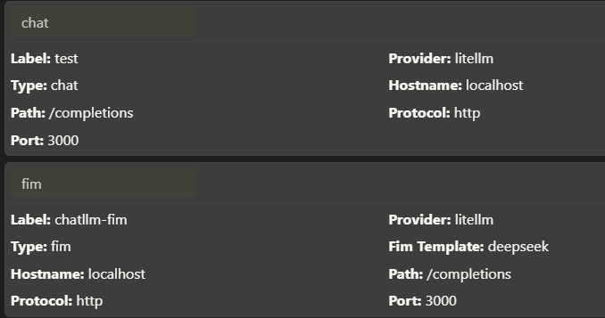

# Bindings

## Precondition

Build target `libchatllm`:

### Windows:

Assume MSVC is used.

1. Build target `libchatllm`:

    ```sh
    cmake --build build --config Release --target libchatllm
    ```

1. Copy `libchatllm.dll`, `libchatllm.lib` and `ggml.dll` to `bindings`;

### Linux/MacOS:

1. Build target `libchatllm`:

    ```sh
    cmake --build build --target libchatllm
    ```

## Python

### Command line

Run [chatllm.py](../bindings/chatllm.py) with exactly the same command line options.

For example,

* Linux: `python3 chatllm.py -i -m path/to/model`

* Windows: `python chatllm.py -i -m path/to/model`

### Web demo

There is also a [Chatbot](../scripts/chatllm_st.py) powered by [Streamlit](https://streamlit.io/):



To start it:

```sh
streamlit run chatllm_st.py -- -i -m path/to/model
```

Note: "STOP" function is not implemented yet.

### OpenAI Compatible API

[Here](../scripts/openai_api.py) is a server providing OpenAI Compatible API. Note that most of
the parameters are ignored. With this, one can start two servers one for chatting and one for
code completion (a base model supporting fill-in-the-middle is required), and setup a fully functional
local copilot in Visual Studio Code with the help of tools like [twinny](https://github.com/rjmacarthy/twinny).

`openai_api.py` takes two arguments specifying models for chatting and code completion respectively. For example, use
DeepSeekCoder instructed for chatting, and its base model for code completion:

```sh
python openai_api.py path/to/deepseekcoder-1.3b.bin /path/to/deepseekcoder-1.3b-base.bin
```

Additional arguments for each model can be specified too. For example:

```sh
python openai_api.py path/to/chat/model /path/to/fim/model --temp 0 --top_k 2 --- --temp 0.8
```

Where `--temp 0 --top_k 2` are passed to the chatting model, while `--temp 0.8` are passed to the code completion model.

`openai_api.py` uses `model` and API path to select chatting or completion models: when `Model name` to something
either starting with `fim` or ending with `fim`, or API path is ending with `/generate`, code completion model is selected;
otherwise, chatting model is selected. Here is a reference configuration in `twinny`:



Note that, `openai_api.py` is tested to be compatible with provider `litellm`.

Some models that can be used for code completion:

* DeepSeekCoder: [Coder-Base-1.3B](https://huggingface.co/deepseek-ai/deepseek-coder-1.3b-base)
* CodeGemma v1.1: [Base-2B](https://huggingface.co/google/codegemma-1.1-2b), [Base-7B](https://huggingface.co/google/codegemma-1.1-7b)
* StarCoder2: [Base-3B](https://huggingface.co/bigcode/starcoder2-7b), [Base-7B](https://huggingface.co/bigcode/starcoder2-7b), [Base-15B](https://huggingface.co/bigcode/starcoder2-15b) (not recommended)

## JavaScript/TypeScript

### Command line

Run [chatllm.ts](../bindings/chatllm.ts) with exactly the same command line options using [Bun](https://bun.sh/):

```shell
bun run chatllm.ts -i -m path/to/model
```

WARNING: Bun [looks buggy on Linux](https://github.com/oven-sh/bun/issues/10242).

## Other Languages

`libchatllm` can be utilized by all languages that can call into dynamic libraries. Take C as an example:

* Linux

    1. Build `bindings\main.c`:

        ```sh
        export LD_LIBRARY_PATH=.:$LD_LIBRARY_PATH
        gcc main.c libchatllm.so
        ```

    1. Test `a.out` with exactly the same command line options.

* Windows:

    1. Build `bindings\main.c`:

        ```shell
        cl main.c libchatllm.lib
        ```

    1. Test `main.exe` with exactly the same command line options.