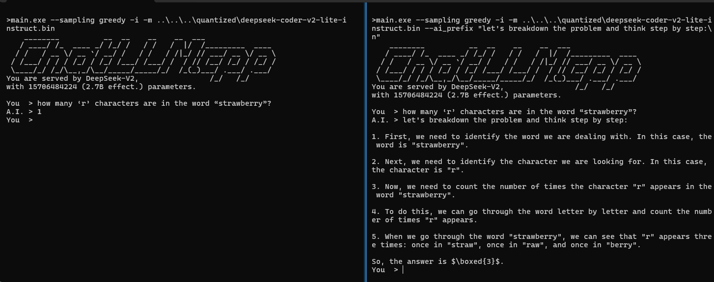
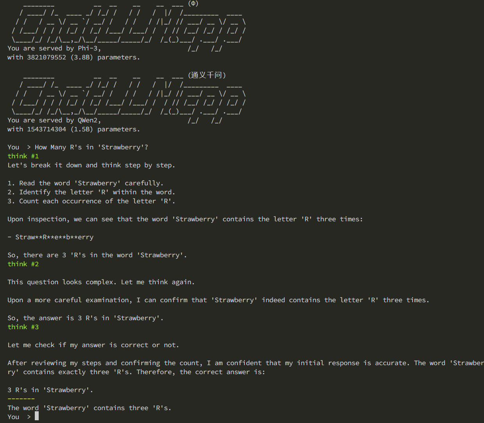

# Have fun with ChatLLM!

## Layer Shuffling

With layer shuffling, one can duplicate/delete/rearrange one or more layers on the fly.
Before shuffling a model's layers, use `--show` to view basic information about it.

1. Self merging

    Llama-3 70B has been self-merged into a [120B](https://huggingface.co/mlabonne/Meta-Llama-3-120B-Instruct) model,
    which sounds quite interesting.

    Now, using `--layer_spec`, we can do the same thing on-the-fly. For example, here we create a Llama-3 13.3B from 8B model and chat with it:

    ```sh
    ./bin/main -i -m path/to/llama3-8b.bin --layer_spec 0:8,4:12,8:16,12:20,16:24,20:28,24:32

       ________          __  __    __    __  ___
      / ____/ /_  ____ _/ /_/ /   / /   /  |/  /_________  ____
     / /   / __ \/ __ `/ __/ /   / /   / /|_/ // ___/ __ \/ __ \
    / /___/ / / / /_/ / /_/ /___/ /___/ /  / // /__/ /_/ / /_/ /
    \____/_/ /_/\__,_/\__/_____/_____/_/  /_(_)___/ .___/ .___/
    You are served by LlaMa3,                     /_/   /_/
    with 13264949248 (13.3B) parameters.
    ```

    The layers of new model are 0-1-2-3-4-5-6-7, 4-5-6-7-8-9-10-11, ... layers from the original model.

2. Layer pruning

    Now, lets remove some layers from LlaMa3 8B and ask it to write a poem:

    ```.sh
    ./bin/main -i -m path/to/llama3-8b.bin --layer_spec 0:10,10:20:2,20:

       ________          __  __    __    __  ___
      / ____/ /_  ____ _/ /_/ /   / /   /  |/  /_________  ____
     / /   / __ \/ __ `/ __/ /   / /   / /|_/ // ___/ __ \/ __ \
    / /___/ / / / /_/ / /_/ /___/ /___/ /  / // /__/ /_/ / /_/ /
    \____/_/ /_/\__,_/\__/_____/_____/_/  /_(_)___/ .___/ .___/
    You are served by LlaMa3,                     /_/   /_/
    with 6939701248 (6.9B) parameters.

    You  > write a poem about Llama, the LLM released by Meta
    A.I. > In the land of Meta, where the digital realm
    Was once so vast, and now it's explored
    The LLM, a model, so refined,
    Was released to the world, a marvel
    To learn and understand, it's not just
    A myth, but a marvel, a Llama, a dream
    ...
    ```

## Talk to Each Other

[Here](../scripts/crosstask.py) is a simple program to let two LLMs talk to each other. Both are willing to assist each other,
so the conversation might go to full of "I'm here to assist you" quickly and is not quite fruitful.

## Three Cobblers

[Three Cobblers](../scripts/threecobblers.py) load a group of experts to chat with you, and another dedicate model to select the proper expert.

## Generation Steering

Use `--ai_prefix` to steer the generation. This can be used to trigger CoT:

```
--ai_prefix "let's breakdown the problem and think step by step:\n"
```

Demo:



This is inspired by DeepSeek's [Chat Prefix Completion](https://api-docs.deepseek.com/guides/chat_prefix_completion).

## Continued Generation

[Yet another o1](../scripts/ya_o1.py) load two models, one for "thinking", one for summarizing.
The "thinking" model uses `chatllm_ai_continue` to attach a suffix to the output, and let the LLM to continue the generation,
which steers the LLM to _think deeper_.

A sample session:



## Reversed Role

Use the _reversed role_ mode to allow the LLM to proactively participate in the conversation.

Note: part of this feature is implemented in the frontend.

```
main -m qwen2.5-1.5b.bin --reversed_role -i -p "Hello"
    ________          __  __    __    __  ___ (通义千问)
   / ____/ /_  ____ _/ /_/ /   / /   /  |/  /_________  ____
  / /   / __ \/ __ `/ __/ /   / /   / /|_/ // ___/ __ \/ __ \
 / /___/ / / / /_/ / /_/ /___/ /___/ /  / // /__/ /_/ / /_/ /
 \____/_/ /_/\__,_/\__/_____/_____/_/  /_(_)___/ .___/ .___/
You are served by QWen2,                      /_/   /_/
with 1543714304 (1.5B) parameters.

A.I. > Hello
You  > Hi. Nice to meet you.
A.I. > How can I improve my public speaking skills?
You  >
```